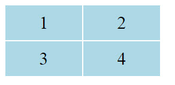
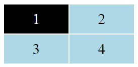

# IT3 im SS 2019
Hier finden sie Dateien aus der IT3 Vorlesung. 

## Javascript
Dateien zum Teil Javascript finden sie im Verzeichnis  JS

#### Entwickleroptionen im Browser einschalten

`F12` in Chrome und auch in Firefox. Unerlässlich für Fehlersuche und Verständnis!

#### Variablen-Deklaration

Variablen sind Container für Werte.  Variablen müssen deklariert werden, d.h. der Name der Variable muss mit Javascript vereinbart werden. Schlüsselwort ``let``

```js
 let timerWert;
```

#### Wertzuweisung

Einer Variable, also einem Container, wird ein Wert zugewiesen. Die Variable muss einer vorhergehenden Zeile deklariert sein.

```js
 timerWert = 10;
```

#### Funktions-Deklaration

Funktionen sind ein Grundbaustein in JavaScript. Eine Funktion ist eine Prozedur - eine Reihe von Anweisungen, um eine Aufgabe auszuführen oder eine Wert auszurechnen. Um eine Funktion zu verwenden, musse Sie vorher ebenfalls deklariert werden. Dies erfolgt mit dem Schlüsselwort `function`

```js
  function aendereNameP1() {
        let name;
        name = prompt("Neuer Name: ");
        player1.textContent = "Player 1: " + name;
    }
```
#### Funktionsaufruf

Das Definieren einer Funktion führt diese noch nicht aus. Die Definition gibt der Funktion lediglich einen Namen und beschreibt was geschehen soll, wenn die Funktion aufgerufen wird. Erst der **Aufruf** ermöglicht es, die Aktionen auszuführen.  Funktionen können in anderen Funktionen aufgerufen werden.

Beispiel für Funktionsaufruf:

```js
aendereName()
```

EIn spezieller Funktionsaufruf ist 

```js
console.log("Test");
```

Die Funktion darf nicht deklariert werden. Sie gibt den Text in den Klammern in der Konsole aus.


#### Zugriff auf einer Element des Dokumentenbaums (Elementreferenz)

Achtung; Die Variable muss vorher deklariert werden.

```js
  kopf = document.getElementById("header");
```

Im Html-Text muss sich ein Element mit dieser Id finden, zum Beispiel:

```hmtl
...
<div id="header"> Spielerauswahl </div></br>
<p id="p1">Player 1: Chris</p><br>
...
```
#### Eventlistener hinzufügen

```js
player1 = document.getElementById("p1");
player1.addEventListener('click', aendereNameP1);
```

Events: 

```
click, mouseenter, mouseleave
```

#### Setzen des Textinhaltes eines Elementes

```js
player1.textContent = "Player 1: Huber";
```

#### Definieren einer Klasse für ein Element

```js
 player1.className = "rot";
```

Achtung: Die Klasse muss CSS Teil angegeben sein. Beispiel:

```css
.rot {
      background-color: red;
}
```
#### HTML Element erzeugen

Ein neues HTML Element wird immer als *Child* eines existierenden Elementes erzeugt. 


## Aufgabe zu HTML, CSS und Styles

##### 1. Erzeugen Sie eine HTML Datei, die im Browser etwa wie folgt angezeigt wird (achten sie auf Abstände und Textgröße):



##### 2. Erweitern Sie die Datei um einen Javascript Anteil, so dass durch "Hineinfahren" in einen der vier Bereiche die Hintergrundfarbe dieses Bereiches auf Schwarz wechselt und der Text weiß dargestellt wird.



(Situation, nachdem in die Zelle 1 "gefahren" wurde).

##### 2. Erweitern Sie die Datei so, dass eine Sekunde, nachdem eine Zelle schwarz wurde, der Originalzustand (nach Schritt 1) wieder hergestellt wird.

